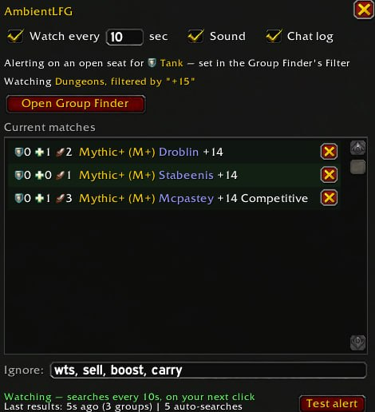
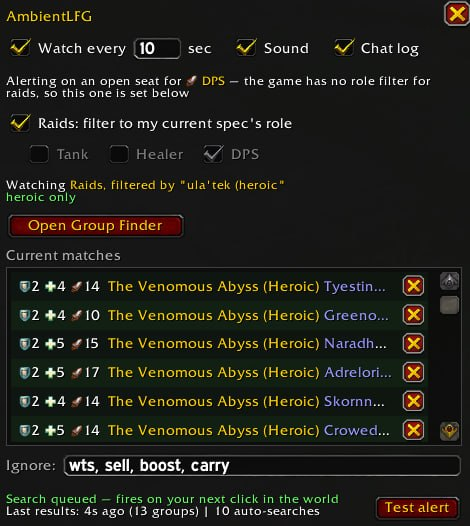

# AmbientLFG

Watches the WoW Premade Group Finder for the groups you're actually looking for and alerts you the moment one appears — so you can stop refreshing the browse window and just play.

## What it does

You set up the search you want in Blizzard's own Group Finder — category, filters, and the search box, including a keystone level or a range like `12-14`. Run it once. AmbientLFG then replays exactly that search in the background and alerts you when a group comes up that has a seat you can fill.

- **Alerts**: raid-warning banner, sound, and a flashing taskbar icon if you're alt-tabbed.
- **Roles**: whichever "role available" boxes you ticked in the Group Finder's own Filter. A group alerts if any one of those seats is still open. Tick none and every group the search returns will alert. The addon reads that setting rather than keeping a second copy of it. Those boxes are a Dungeons filter — the game itself drops them for Raids and everything else, so the addon does too. For raid searches it keeps its own role setting instead, which follows whichever spec you are currently playing unless you untick "Raids: filter to my current spec's role" and pick for yourself. Raid listings publish no per-role caps, so a tank or healer pick genuinely narrows the results while a DPS one passes any group that isn't full.
- **Background watching**: one switch. While it is ticked the addon re-runs your search every few seconds as you play, pausing while you browse the Group Finder yourself and resuming when you close it. It also pauses while your own group is listed — you are not looking for a group then — and resumes when you take the listing down. Your own group's listing never alerts and never appears in the matches list.
- **Live matches list**: the `/alfg` window shows every currently-listed matching group with its tank/healer/dps counts, activity and title.
- **Seller filtering**: boost/carry advertisers are recognized and hidden automatically; block any leader forever with one click.

## Why the search lives in the Group Finder

An addon cannot read a listing's title. Since WoW 12.0 the title arrives as an opaque token — the game renders it on screen, but the characters an addon receives are an id, not words — and that is true even when the group typed the title themselves. So a keyword like `+14` can never match a `+14` listing, however plainly it reads to you.

Blizzard's search box is not text matching. For keystones it is a key-*range* filter evaluated by the server against the real key level, which is why it is the only thing that can select one. Setting it up there rather than duplicating it here means the addon watches exactly what you'd see if you kept clicking Refresh yourself.

The filter keeps applying once you close the window, which is why the `/alfg` window always names the search it is currently watching.

## Usage

1. Open the Group Finder, set up the search you want, and run it once
2. `/alfg` to open the settings window
3. Tick the roles you can play in the Group Finder's Filter button
4. Tick "Watch every N sec"
5. When the alert fires, open the Group Finder and sign up

Signing up stays a manual click — Blizzard requires it — so pairing this with a one-click-apply addon like SmartLFG works well.

## Commands

`/alfg` opens the window. `/alfg on`, `/alfg interval 15`, `/alfg ignore wts`, `/alfg block <leader>`, `/alfg diag` to see exactly what the addon received for the listings on screen.
